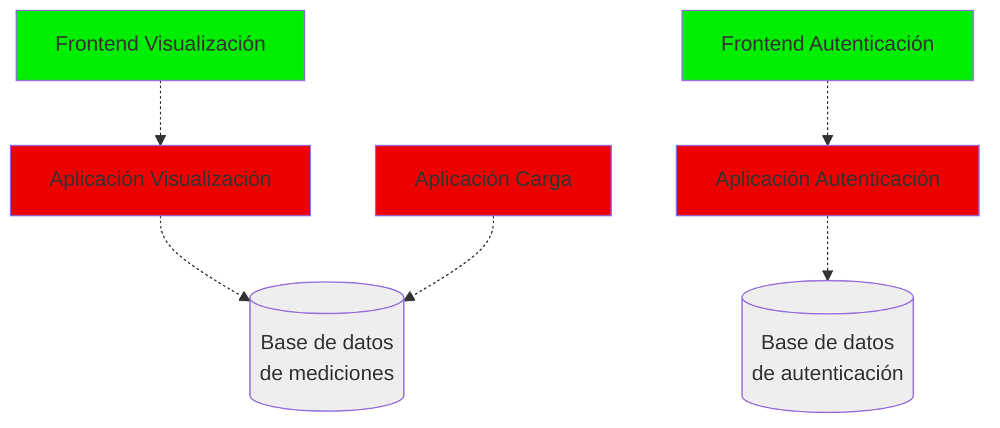
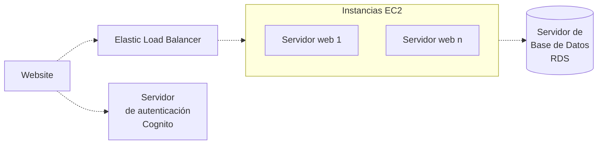

<rel >

```mermaid
graph TB
    fev[Frontend Visualización];
    fea[Frontend Autenticación];
    apv[Aplicación Visualización];
    apc[Aplicación Carga];
    apa[Aplicación Autenticación];
    bdg[(Base de datos</br> de mediciones)];
    bdu[(Base de datos</br> de autenticación)];
    fev-.->apv;
    fea-.->apa;
    apv-.->bdg;
    apc-.->bdg;
    apa-.->bdu;
    classDef fe fill:#0e0
    classDef ap fill:#e00
    classDef bd fill:#eee
    class fev,fea fe
    class apv,apc,apa ap
    class bdg,bdu bd
```

 
 
 
 
 
 

```mermaid
graph LR
    web[Website];
    elb[Elastic Load Balancer];
    sa[Servidor <br/>de autenticación<br/>Cognito]
    subgraph x[Instancias EC2]
        inst[Servidor web 1];
        
        instn[Servidor web n];
    end
    sbd[(Servidor de </br>Base de Datos</br>RDS)];
    web -.-> elb;
    web -.-> sa;
    elb -.-> x;
    
    x -.-> sbd;
```